# 更改Eclipse中Tomcat默认部署目录

> Tomcat启动的日志如下图：

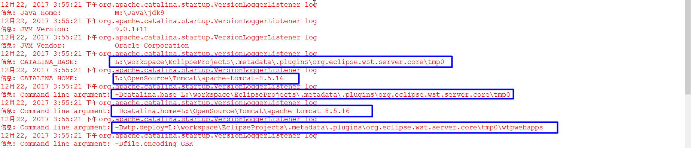

从启动日志中可以看出项目被发布到下面的目录中：

**`L:\workspace\EclipseProjects\.metadata\.plugins\org.eclipse.wst.server.core\tmp0\wtpwebapps`**

打开该目录可以看到存在weixin这样一个文件夹，这就是我们访问的项目目录。如下：

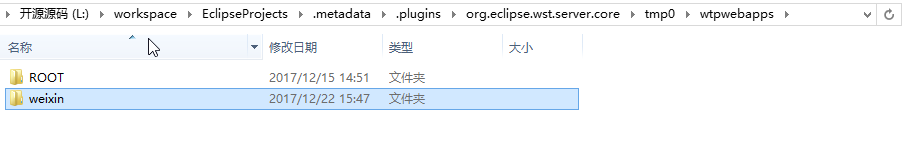

再打开 **`L:\workspace\EclipseProjects\.metadata\.plugins\org.eclipse.wst.server.core\tmp0\`** 这个目录，
可以看到这个目录下的结构和 **`L:\OpenSource\Tomcat\apache-tomcat-8.5.16`** 的目录结构是一模一样的，只是多了个wtpwebapps目录。

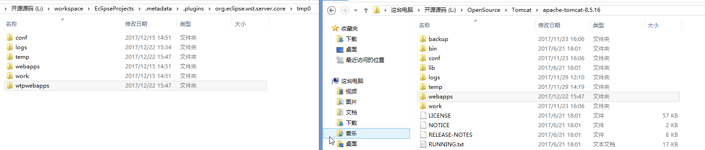

其实 **`L:\workspace\EclipseProjects\.metadata\.plugins\org.eclipse.wst.server.core\tmp0\`** 
这个目录就是eclipse的对 **`L:\OpenSource\Tomcat\apache-tomcat-8.5.16`** 目录的一个克隆，
从而使**`L:\workspace\EclipseProjects\.metadata\.plugins\org.eclipse.wst.server.core\tmp0\`** 也能够具备源服务器的功能。

如果再添加几个服务器，就会在 **`L:\workspace\EclipseProjects\.metadata\.plugins\org.eclipse.wst.server.core\`** 
目录下依次出现temp0、temp1等多个克隆服务器，但是这里每次只能启动上面一个克隆服务器，因为他们都使用的是相同的启动端口（当然还有相同的关闭端口等）。

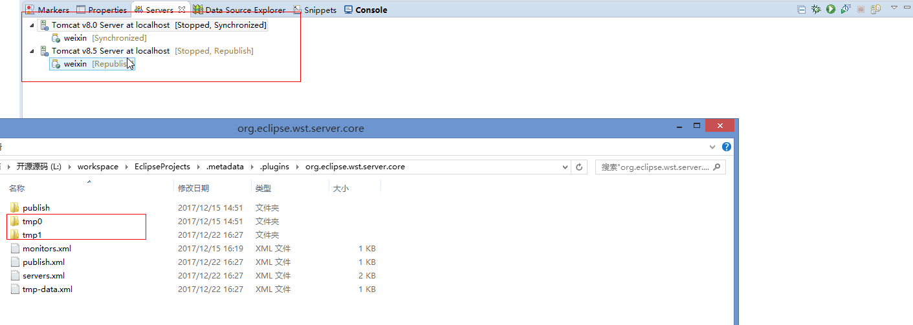

这样会给我们带来很多的不方便。
例如：当我们在进行开发的时候，项目需要将上传的图片放入到工程的同级目录的upload文件夹的时候，会发现图片是上传到了所在的目录 **`L:\workspace\EclipseProjects\.metadata\.plugins\org.eclipse.wst.server.core\tmp0\wtpwebapps\upload\`**，但是无法在浏览器中访问到上传的图片。
这时候我们可以手动将该upload目录整个复制到 **`L:\workspace\EclipseProjects\.metadata\.plugins\org.eclipse.wst.server.core\tmp0\webapps\`**，这时在浏览器中的确就可以访问了。造成这种现象的原因是tomcat服务器默认webapps为工程目录，而不是 wtpwebapps 目录。
之所能够通过浏览器访问 **`L:\workspace\EclipseProjects\.metadata\.plugins\org.eclipse.wst.server.core\tmp0\wtpwebapps\weixin\`**下的weixin这个项目，是由于eclipse通过tomcat发布项目的时候在 **`L:\workspace\EclipseProjects\.metadata\.plugins\org.eclipse.wst.server.core\tmp0\conf`**目录的server.xml

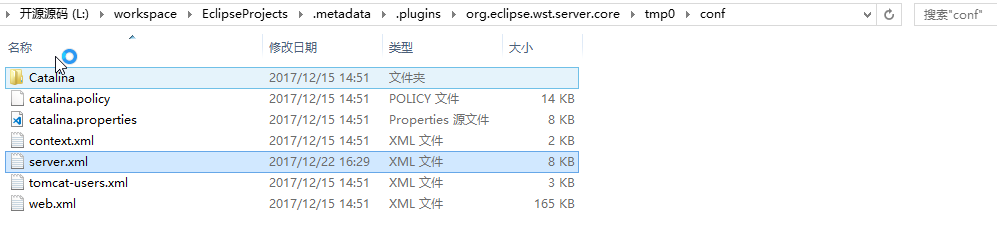

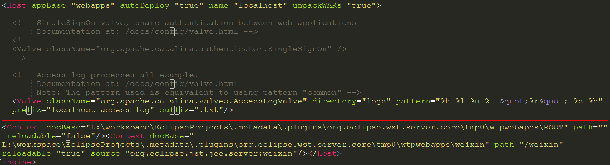

通过在查看eclipse中新建的tomcat属性来了解，如下图中Server Locations中所示：

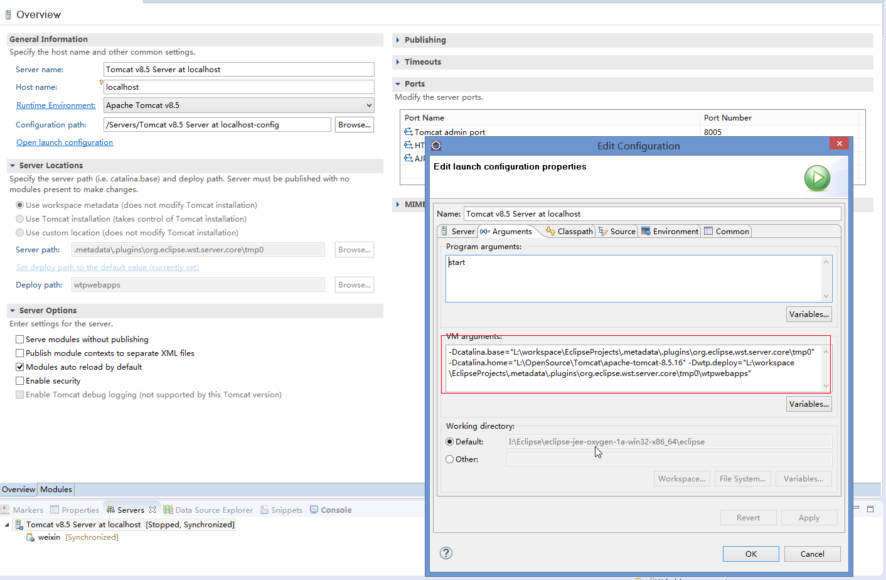

> 通过以下方式修改默认部署目录： 

双击服务器，修改 `Server Locations` 选项为 `Use Tomcat installation(takes control of Tomcat installation)` ，然后将 `Deploy path` 改为 `webapps` 点击 `open launch configuration` → `Arguments` ，将 `Working directory` 修改为 `tomcat` 下的 `bin` 目录。 

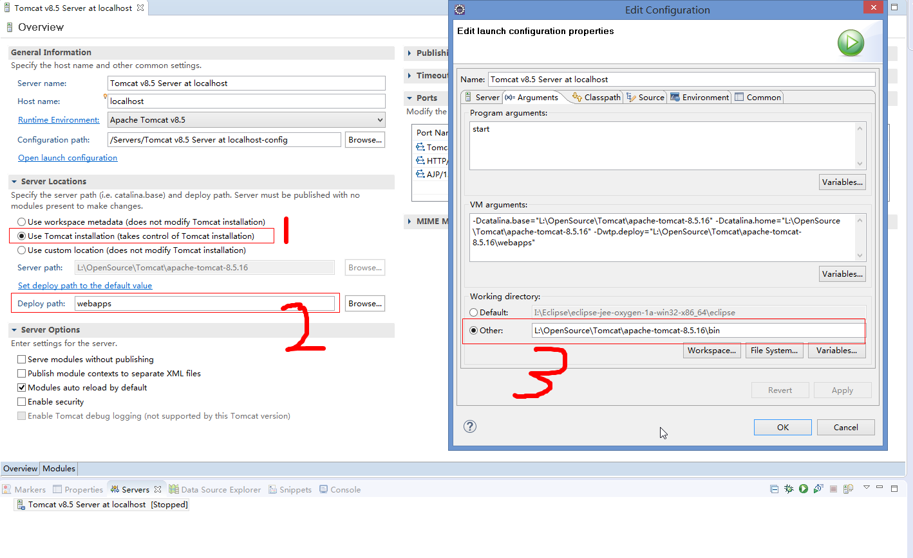

在修改的时候会发现界面中的 `Server Locations` 禁用了，如图所示

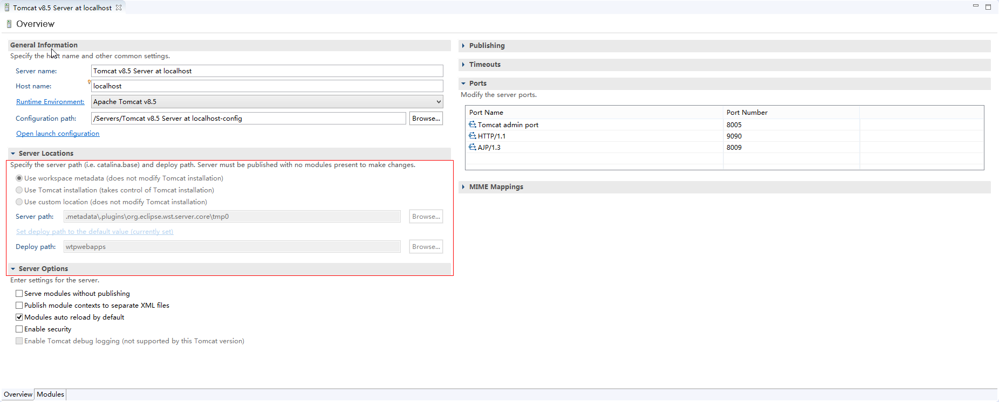

第一种最直接的办法就是删除原有的服务器，重新新建一个，并且先不要添加任何工程进去。 
第二种是先把tomcat下的所有项目删除，然后右击，选择clean。再次双击tomcat进入设置界面，此时可看到Service Locations下各个选项已处于可编辑状态了。 

删除tomcat服务器下的所有项目

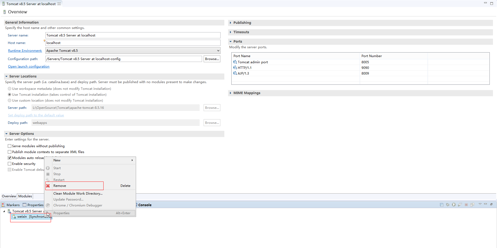

点击tomcat服务器右键选择clean

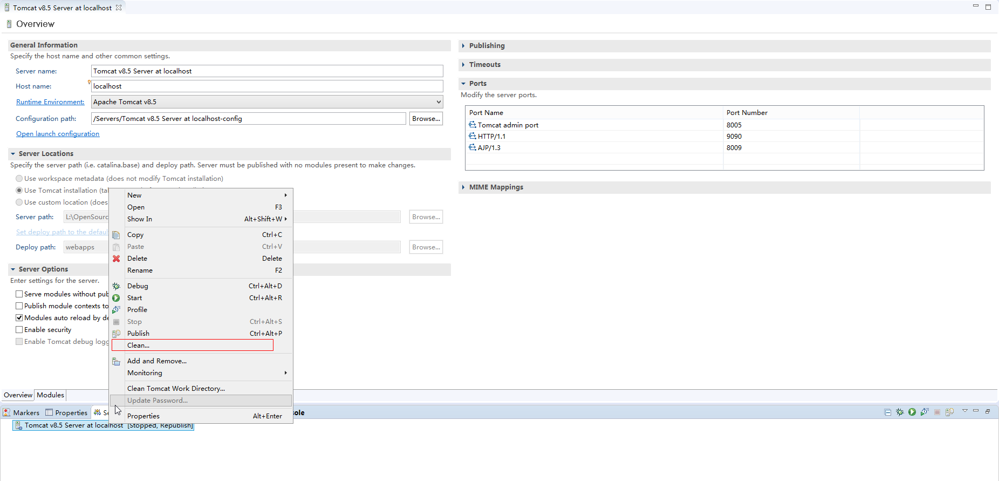

再次双击tomcat进入设置界面

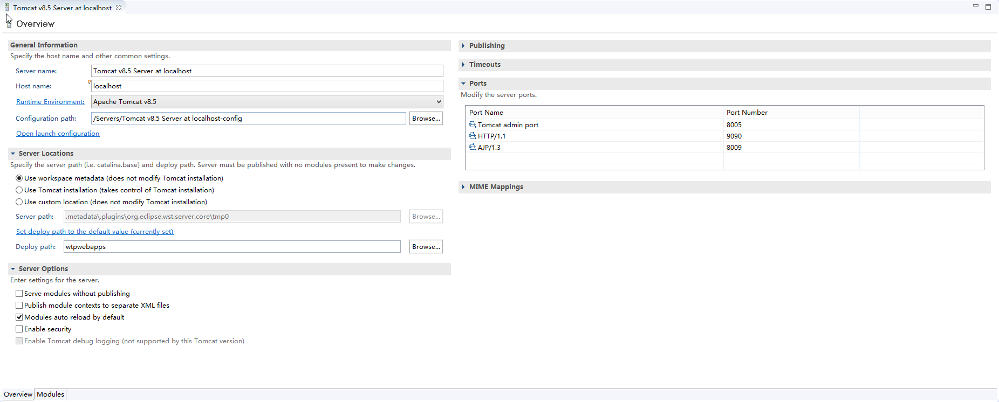