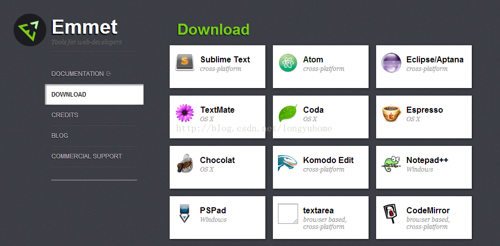
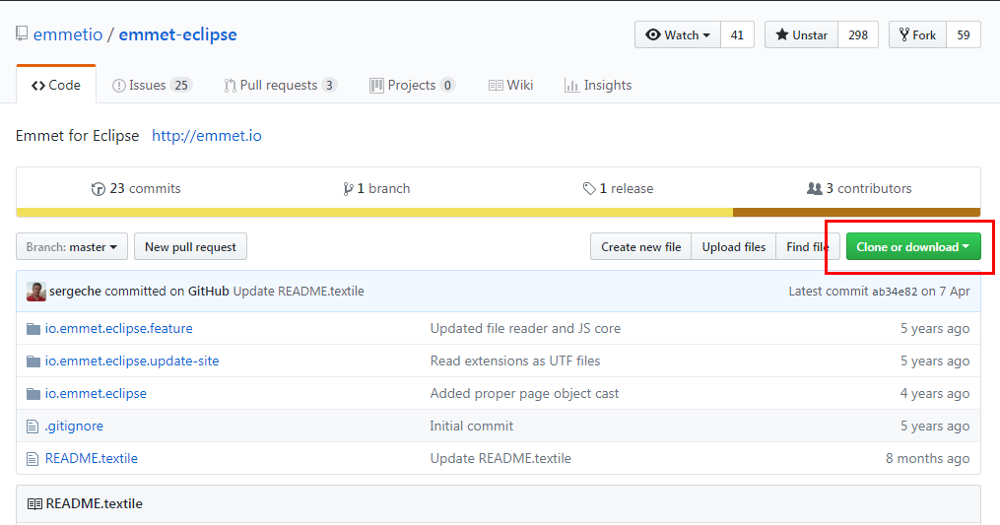
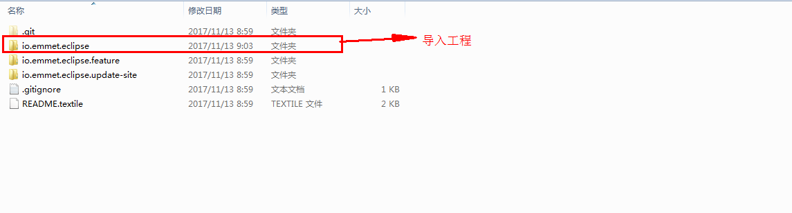
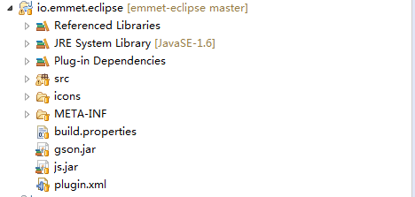
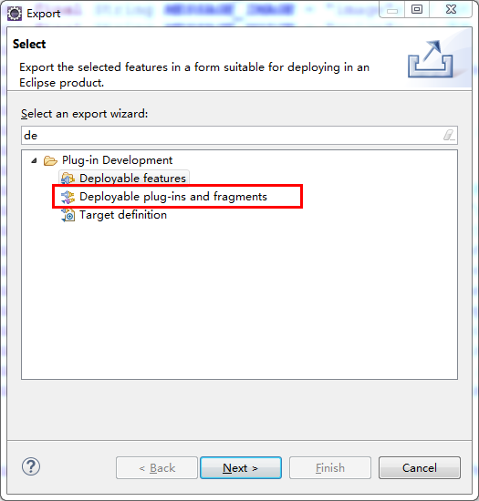
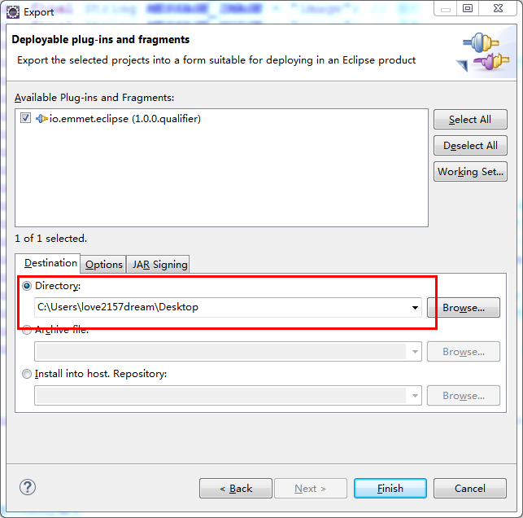
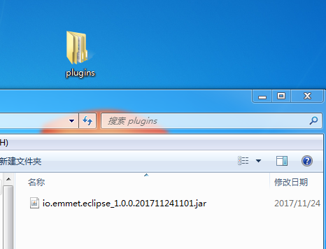
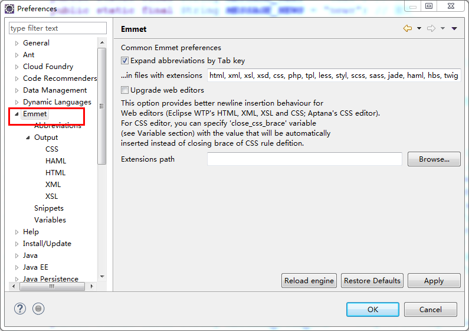

### 1.如果需要离线安装```emmet```，需要从官方网站上下载```emmet```的源码包，然后导出为我们需要的插件格式，首先登陆```ememt```的官网，```http://emmet.io```，然后选择下载的连接，跳转到下载的界面，如下所示： 


### 2.在这里选择Eclipse一项，会跳转到github上，在github上选择， 右侧的download zip选项，如下图所示：



### 3.下载源代码之后，然后选择里面的一个io.emmet.eclipse的文件夹，将这个文件夹导入到Eclipse的工作空间中，如下图所示： 



### 4.导入完成后，可以在Eclipse的工作空间中看到这个项目，如下图所示： 


### 5. 然后在项目上选择右键Export选项,选择插件部署的选项，如下图所示： 



### 6.然后选择输出的目录，如下图所示：


### 7.导出完成后会在目录下生成一个plugins的文件夹，里面有一个所需要的插件文件如下图所示： 


### 8.最后将这个文件夹放入到Eclipse的dropins文件夹下即可，重启Eclipse，如果在首选项里看到Emmet的信息，说明安装成功了




### 9.jar包下载地址
 [emmet点击下载](emmet.zip)
