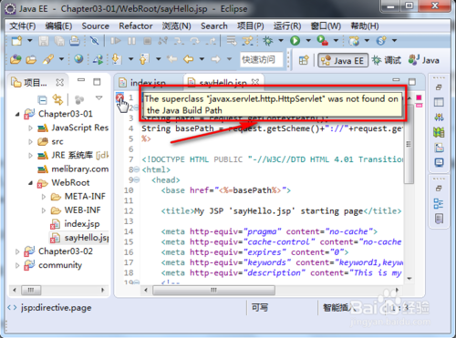
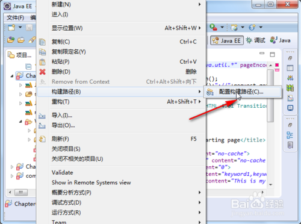
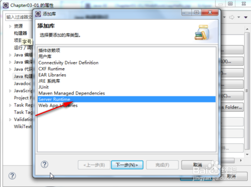
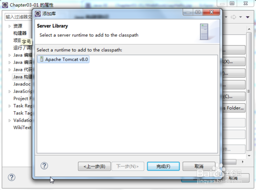
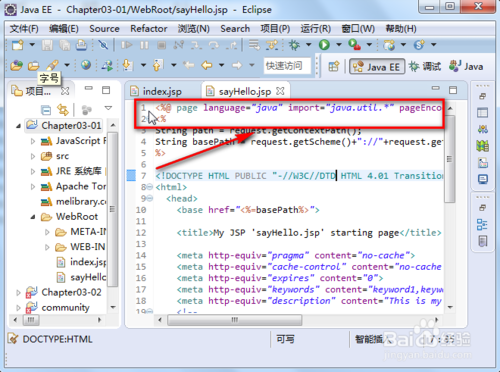

# 我们在用Eclipse进行Java web开发时，可能会出现这样的错误：The superclass javax.servlet.http.HttpServlet was not found on the Java Build Path。

### 1.我们遇到的错误显示如下：

### 2.我们右击有错误提示的文件夹，如下： 

### 3.我们点击”配置构建路径“，如下： 

### 4.我们再点击”添加库“，如下 

### 5.我们选中上图中标出的选项，再点击下一步，如下： 

### 6.我们再点击”完成“，如下： 

### 7.我们再点击”正常“，即可完成设置。这样我的错误就会消失了，如下: 
