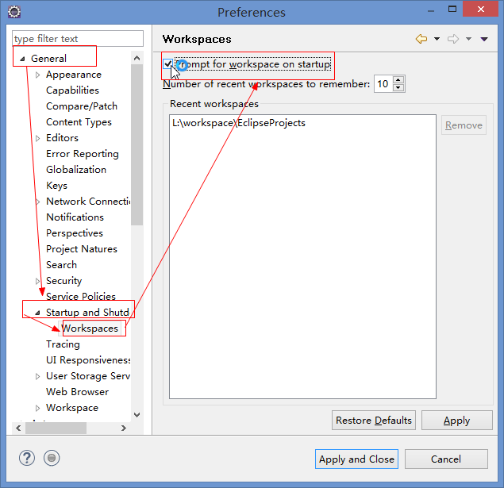
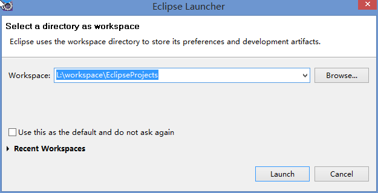

如果以前设置了默认的workspace，现在又想取消设置，可通过下面两种方式来设置：

# 通过eclipse界面设置

 > 首先启动eclipse，然后选择工具条上的widow–>preferences–>General–>Startup and Shutdown–>Workspaces，打开如下界面： 
 
 
 
 > 关闭eclipse，重新打开，会出现以下界面，重新选择空间。如果选择工具条上的File→Restart则不会出现以下界面
  
 

# 直接修改eclipse配置文件

打开eclipse配置文件，`eclipse安装目录下\configuration\.settings\org.eclipse.ui.ide.prefs`

<font color=red>将SHOW_WORKSPACE_SELECTION_DIALOG的值修改为true即可</font>

```code
MAX_RECENT_WORKSPACES=10
RECENT_WORKSPACES=L\:\\workspace\\EclipseProjects
RECENT_WORKSPACES_PROTOCOL=3
SHOW_RECENT_WORKSPACES=true
SHOW_WORKSPACE_SELECTION_DIALOG=true
eclipse.preferences.version=1
```