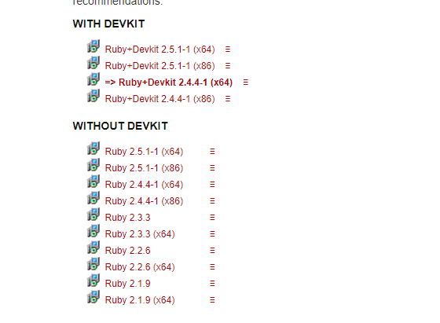
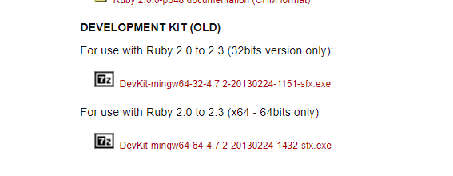
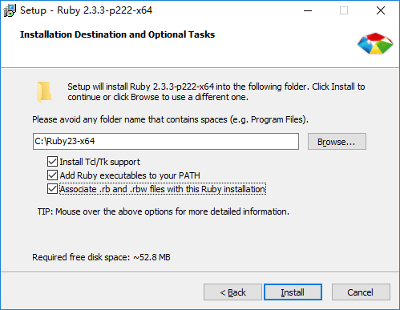
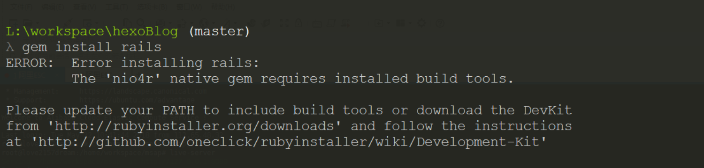
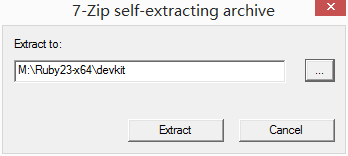
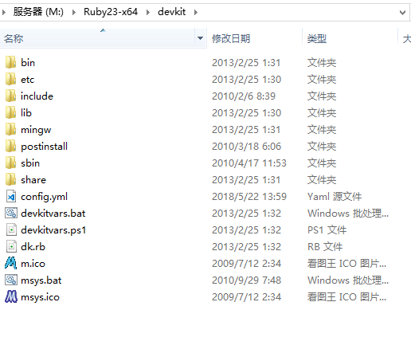
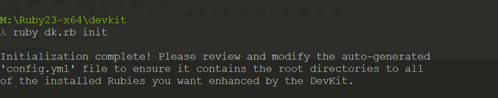
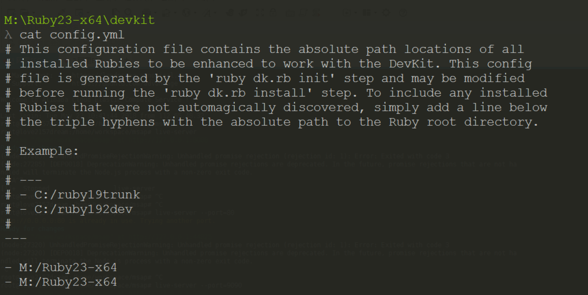
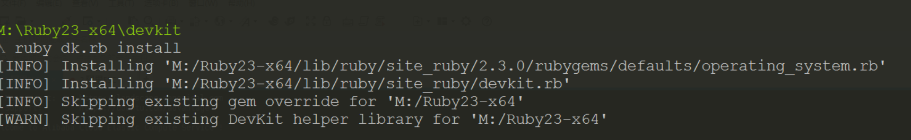
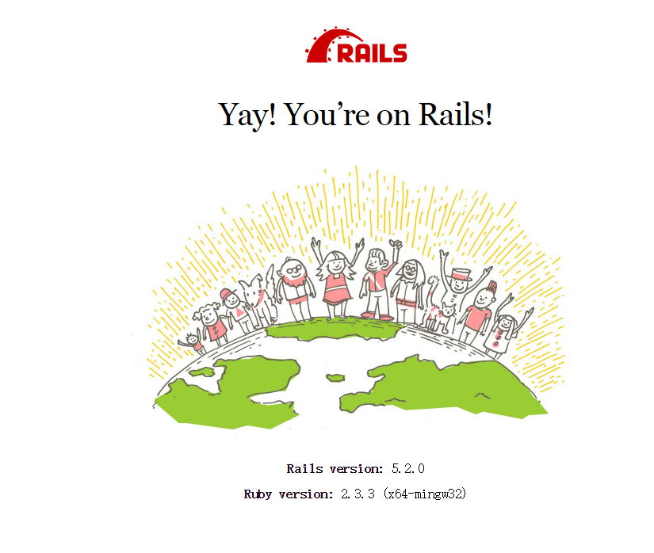

# 1.下载[RubyInstallers](https://rubyinstaller.org/downloads/)安装包

https://rubyinstaller.org/downloads/

下载分为两种安装包，一个带有devkit，一个不带，但是需要单独下载devkit



需要单独下载的devkit



# 2.安装Ruby

以管理员身份运行`rubyinstaller`安装程序，将”添加`Ruby`的可执行文件所在路径添加到PATH路径”选中，如下图所示，然后一直下一步知道完成安装：



注意事项：安装路径中不能有空格和中文。

安装结束后，打开`windows`命令行，输入命令`ruby -v`,如果能返回正确的`ruby`版本，则表示`ruby`安装成功；
``` bash
$ ruby -v
ruby 2.3.3p222 (2016-11-21 revision 56859) [x64-mingw32]

$ gem -v
2.6.14
```

由于官方的`https://rubygems.org`被**，需要用国内的`rubygems`的镜像网站地址替换官方的源，方法如下：

在`window`命令行下输入如下命令移除官方的源：

``` bash
$ gem source -r https://rubygems.org/
```

再使用如下命令添加`baotao`的源：

``` bash
$ gem source -a http://gem.ruby-china.org/
```

统一改写如下：

``` bash
$ gem sources --add https://gems.ruby-china.org/ --remove https://rubygems.org/
$ gem sources -l
https://gems.ruby-china.org
# 确保只有 gems.ruby-china.org
```

更新`RubyGems`版本

``` bash
$ gem update --system # 这里需要翻墙一下，如果配置了sources就不需要了
Latest version currently installed. Aborting.

$ gem -v
2.6.14
```

如果你使用Gemfile 和 Bundler （例如：Rails项目）

``` bash
$ bundle config mirror.https://rubygems.org https://gems.ruby-china.org
```

这样你不用改你的Gemfile的source

`SSL` 证书错误
正常情况下，你是不会遇到 `SSL` 证书错误的，除非你的 `Ruby` 安装方式不正确。

如果遇到 `SSL` 证书问题，你又无法解决，请修改 `~/.gemrc` 文件，增加 `ssl_verify_mode: 0` 配置，以便于 `RubyGems` 可以忽略 `SSL` 证书错误。
``` bash
---
:sources:
- https://gems.ruby-china.org
:ssl_verify_mode: 0
```
如果你在意 `Gem` 下载的安全问题，请正确安装 `Ruby、OpenSSL`，建议部署 `Linux` 服务器的时候采用 这个 `RVM` 安装脚本 的方式安装 `Ruby`。

其他说明
`Bundler::GemspecError: Could not read gem at /home/xxx/.rvm/gems/ruby-2.1.8/cache/rugged-0.23.3.gem. It may be corrupted`.，这类错误是网络原因下载到了坏掉的文件到本地，请直接删除那个文件。

# 3.安装devkit

如果你是单独安装 `RubyInstaller` 在需要安装 `devkit`，如果不安装 `devkit` 在安装 `rails`， `mongo`等会出现一下错误

 

我们将下载好的devkit解压到某个文件夹：

打开[DevKit-mingw64-64-4.7.2-20130224-1432-sfx.exe](https://dl.bintray.com/oneclick/rubyinstaller/DevKit-mingw64-64-4.7.2-20130224-1432-sfx.exe)选择目录如下：



解压后的目录如下：



解压完毕后进入到解压文件的命令行目录即 `devkit` 目录，输入命令ruby dk.rb init,如下：



提示信息告诉我们需要修改config.yml文件，于是我们打开该config.yml文件：

修改方法：在"---"后添加“-”加上ruby安装的绝对路径，于是我们在“---”下添加内容如下：
```
- M:\Ruby23-x64
- M:\Ruby23-x64
```
如下如：



保存后关闭文件。再输入命令 `ruby dk.rb install`：



到此，ruby，rubygems，devkit的安装完毕了

# 4.安装rails

``` bash
$ gem install rails
``` 
整个安装过程需要数分钟，安装完毕后，运行如下命令查看 `rails` 的版本。

``` bash
$ rails -v
Rails 5.2.0
```

找个目录创建项目

``` bash
$ rails new demo_app
```
等待数分钟后，安装如下

``` bash
rails new rails_demo_app
      create
      create  README.md
      create  Rakefile
      create  .ruby-version
      create  config.ru
      create  .gitignore
      create  Gemfile
         run  git init from "."
Initialized empty Git repository in L:/workspace/CommonProjects/rails_demo_app/.git/
      create  package.json
      create  app
      create  app/assets/config/manifest.js
      create  app/assets/javascripts/application.js
      create  app/assets/javascripts/cable.js
      create  app/assets/stylesheets/application.css
      create  app/channels/application_cable/channel.rb
      create  app/channels/application_cable/connection.rb
      create  app/controllers/application_controller.rb
      create  app/helpers/application_helper.rb
      create  app/jobs/application_job.rb
      create  app/mailers/application_mailer.rb
      create  app/models/application_record.rb
      create  app/views/layouts/application.html.erb
      create  app/views/layouts/mailer.html.erb
      create  app/views/layouts/mailer.text.erb
      create  app/assets/images/.keep
      create  app/assets/javascripts/channels
      create  app/assets/javascripts/channels/.keep
      create  app/controllers/concerns/.keep
      create  app/models/concerns/.keep
      create  bin
      create  bin/bundle
      create  bin/rails
      create  bin/rake
      create  bin/setup
      create  bin/update
      create  bin/yarn
      create  config
      create  config/routes.rb
      create  config/application.rb
      create  config/environment.rb
      create  config/cable.yml
      create  config/puma.rb
      create  config/storage.yml
      create  config/environments
      create  config/environments/development.rb
      create  config/environments/production.rb
      create  config/environments/test.rb
      create  config/initializers
      create  config/initializers/application_controller_renderer.rb
      create  config/initializers/assets.rb
      create  config/initializers/backtrace_silencers.rb
      create  config/initializers/content_security_policy.rb
      create  config/initializers/cookies_serializer.rb
      create  config/initializers/cors.rb
      create  config/initializers/filter_parameter_logging.rb
      create  config/initializers/inflections.rb
      create  config/initializers/mime_types.rb
      create  config/initializers/new_framework_defaults_5_2.rb
      create  config/initializers/wrap_parameters.rb
      create  config/locales
      create  config/locales/en.yml
      create  config/master.key
      append  .gitignore
      create  config/boot.rb
      create  config/database.yml
      create  db
      create  db/seeds.rb
      create  lib
      create  lib/tasks
      create  lib/tasks/.keep
      create  lib/assets
      create  lib/assets/.keep
      create  log
      create  log/.keep
      create  public
      create  public/404.html
      create  public/422.html
      create  public/500.html
      create  public/apple-touch-icon-precomposed.png
      create  public/apple-touch-icon.png
      create  public/favicon.ico
      create  public/robots.txt
      create  tmp
      create  tmp/.keep
      create  tmp/cache
      create  tmp/cache/assets
      create  vendor
      create  vendor/.keep
      create  test/fixtures
      create  test/fixtures/.keep
      create  test/fixtures/files
      create  test/fixtures/files/.keep
      create  test/controllers
      create  test/controllers/.keep
      create  test/mailers
      create  test/mailers/.keep
      create  test/models
      create  test/models/.keep
      create  test/helpers
      create  test/helpers/.keep
      create  test/integration
      create  test/integration/.keep
      create  test/test_helper.rb
      create  test/system
      create  test/system/.keep
      create  test/application_system_test_case.rb
      create  storage
      create  storage/.keep
      create  tmp/storage
      create  tmp/storage/.keep
      remove  config/initializers/cors.rb
      remove  config/initializers/new_framework_defaults_5_2.rb
         run  bundle install
Fetching gem metadata from https://rubygems.org/..........
Fetching gem metadata from https://rubygems.org/.
Resolving dependencies...
Fetching rake 12.3.1
Installing rake 12.3.1
Using concurrent-ruby 1.0.5
Using i18n 1.0.1
Fetching minitest 5.11.3
Installing minitest 5.11.3
Using thread_safe 0.3.6
Using tzinfo 1.2.5
Using activesupport 5.2.0
Using builder 3.2.3
Using erubi 1.7.1
Using mini_portile2 2.3.0
Using nokogiri 1.8.2 (x64-mingw32)
Using rails-dom-testing 2.0.3
Using crass 1.0.4
Using loofah 2.2.2
Using rails-html-sanitizer 1.0.4
Using actionview 5.2.0
Using rack 2.0.5
Using rack-test 1.0.0
Using actionpack 5.2.0
Using nio4r 2.3.1
Using websocket-extensions 0.1.3
Using websocket-driver 0.7.0
Using actioncable 5.2.0
Using globalid 0.4.1
Using activejob 5.2.0
Using mini_mime 1.0.0
Using mail 2.7.0
Using actionmailer 5.2.0
Using activemodel 5.2.0
Using arel 9.0.0
Using activerecord 5.2.0
Using mimemagic 0.3.2
Using marcel 0.3.2
Using activestorage 5.2.0
Fetching public_suffix 3.0.2
Installing public_suffix 3.0.2
Fetching addressable 2.5.2
Installing addressable 2.5.2
Fetching io-like 0.3.0
Installing io-like 0.3.0
Fetching archive-zip 0.11.0
Installing archive-zip 0.11.0
Fetching bindex 0.5.0
Installing bindex 0.5.0 with native extensions
Fetching msgpack 1.2.4 (x64-mingw32)
Installing msgpack 1.2.4 (x64-mingw32)
Fetching bootsnap 1.3.0
Installing bootsnap 1.3.0 with native extensions
Using bundler 1.16.2
Fetching byebug 10.0.2
Installing byebug 10.0.2 with native extensions
Fetching xpath 3.0.0
Installing xpath 3.0.0
Fetching capybara 3.1.0
Installing capybara 3.1.0
Using ffi 1.9.23 (x64-mingw32)
Fetching childprocess 0.9.0
Installing childprocess 0.9.0
Fetching chromedriver-helper 1.2.0
Installing chromedriver-helper 1.2.0
Fetching coffee-script-source 1.12.2
Installing coffee-script-source 1.12.2
Fetching execjs 2.7.0
Installing execjs 2.7.0
Fetching coffee-script 2.4.1
Installing coffee-script 2.4.1
Using method_source 0.9.0
Using thor 0.20.0
Using railties 5.2.0
Fetching coffee-rails 4.2.2
Installing coffee-rails 4.2.2
Fetching duktape 2.0.1.0
Installing duktape 2.0.1.0 with native extensions
Fetching multi_json 1.13.1
Installing multi_json 1.13.1
Fetching jbuilder 2.7.0
Installing jbuilder 2.7.0
Fetching puma 3.11.4
Installing puma 3.11.4 with native extensions
Using sprockets 3.7.1
Using sprockets-rails 3.2.1
Using rails 5.2.0
Using rb-fsevent 0.10.3
Using rb-inotify 0.9.10
Fetching rubyzip 1.2.1
Installing rubyzip 1.2.1
Using sass-listen 4.0.0
Using sass 3.5.6
Fetching tilt 2.0.8
Installing tilt 2.0.8
Fetching sass-rails 5.0.7
Installing sass-rails 5.0.7
Fetching selenium-webdriver 3.12.0
Installing selenium-webdriver 3.12.0
Fetching sqlite3 1.3.13 (x64-mingw32)
Installing sqlite3 1.3.13 (x64-mingw32)
Fetching turbolinks-source 5.1.0
Installing turbolinks-source 5.1.0
Fetching turbolinks 5.1.1
Installing turbolinks 5.1.1
Fetching tzinfo-data 1.2018.5
Installing tzinfo-data 1.2018.5
Fetching uglifier 4.1.10
Installing uglifier 4.1.10
Fetching web-console 3.6.2
Installing web-console 3.6.2
Bundle complete! 16 Gemfile dependencies, 76 gems now installed.
Use `bundle info [gemname]` to see where a bundled gem is installed.
```

创建完成后，进入项目根目录，执行如下命令，启动服务

``` bash 
$ rails server

=> Rails 5.2.0 application starting in development
=> Run `rails server -h` for more startup options
*** SIGUSR2 not implemented, signal based restart unavailable!
*** SIGUSR1 not implemented, signal based restart unavailable!
*** SIGHUP not implemented, signal based logs reopening unavailable!
Puma starting in single mode...
* Version 3.11.4 (ruby 2.3.3-p222), codename: Love Song
* Min threads: 5, max threads: 5
* Environment: development
* Listening on tcp://0.0.0.0:3000
Use Ctrl-C to stop
Started GET "/" for 127.0.0.1 at 2018-05-22 14:27:23 +0800
Processing by Rails::WelcomeController#index as HTML
  Rendering M:/Ruby23-x64/lib/ruby/gems/2.3.0/gems/railties-5.2.0/lib/rails/templates/r
ml.erb
  Rendered M:/Ruby23-x64/lib/ruby/gems/2.3.0/gems/railties-5.2.0/lib/rails/templates/ra
l.erb (3.0ms)
Completed 200 OK in 131ms (Views: 87.8ms | ActiveRecord: 0.0ms)

```

在浏览器中输入http://localhost:3000/，即可打开示例项目:



至此，ruby on rails的开发环境配置完成；